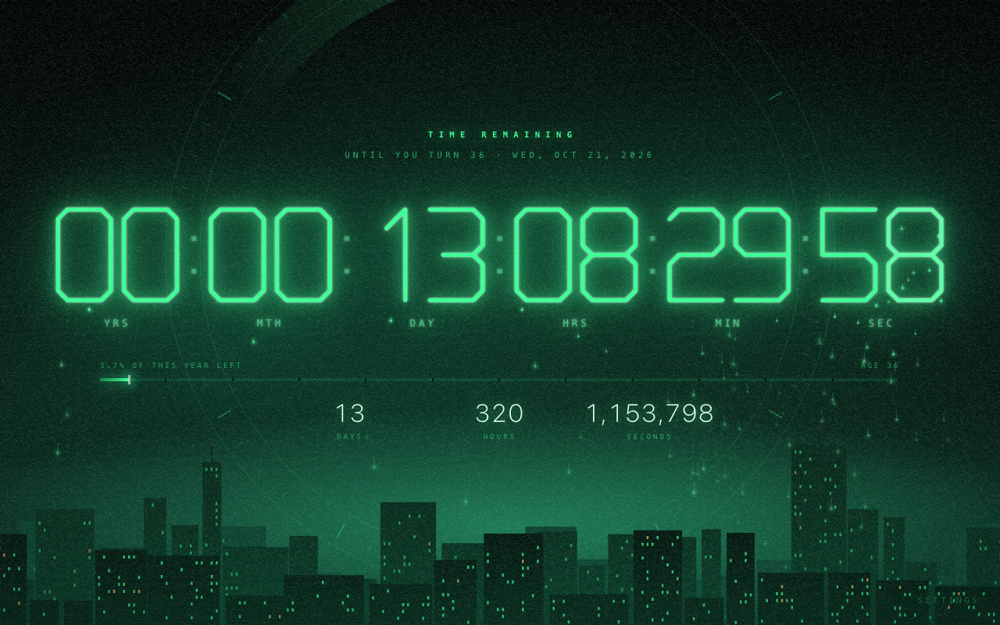
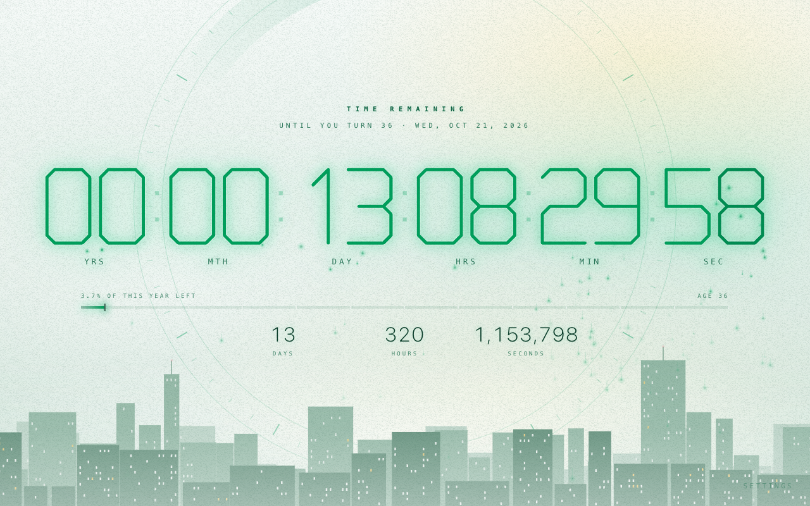

# In Time

Chrome themes (dark and light) and a new-tab page with a glowing **countdown to your next birthday**, drained one second
at a time. Inspired by the forearm clocks in the film *In Time*.

  
  

| Package | What it is |
| --- | --- |
| [`newtab/`](newtab) | Extension (Manifest V3, **no permissions**) that replaces the New Tab page with the clock. Asks for a birthday once. |
| [`theme/`](theme) | Dark Chrome theme: frame, tabs, toolbar, omnibox, and a skyline behind Chrome's own New Tab page. |
| [`theme-light/`](theme-light) | Light Chrome theme. |

A theme is only colours and images: it can't run code or follow the system's light/dark setting. That's why the animation
lives in the extension, and why there are two themes (Chrome wears one at a time).

## Try it

1. Open `chrome://extensions` and switch on **Developer mode**.
2. **Load unpacked** → `theme` (or `theme-light`), then **Load unpacked** → `newtab`.
3. Open a new tab and enter a date of birth.

To just look, open `newtab/newtab.html` in Chrome; no install. Add `?dob=1990-10-21&now=2026-10-20T23:59:57` to watch a birthday
roll over (more [debug parameters](#debug-parameters) below). **Settings** (bottom right) changes the birthday and picks
Auto / Dark / Light; Auto follows the system live. Checked against Chrome 154.

## How it works

- **Clock.** `YY:MM:DD:HH:MM:SS` to midnight at the start of the next birthday, so it never holds more than a year, like the one
  the film hands you at 25. On the birthday it reads `01:00:00:00:00:00`.
- **Animation.** Each digit is a single-stroke SVG path (`pathLength="1"`), so CSS `stroke-dashoffset` alone draws a digit on and
  drains the old one away. Canvas ([`fx.js`](newtab/fx.js)) adds the falling grains and a ring that ticks each second.
  `prefers-reduced-motion` turns the motion off.
- **Maths.** [`core.js`](newtab/core.js) counts months *backwards* from the target. Counting forwards from now clamps at month
  ends (Jan 31 + 1 month = Feb 28) and makes the clock jump up by a day. Feb 29 birthdays fall on Mar 1 in common years.
  [`tools/test-core.js`](tools/test-core.js) sweeps the readout second by second across month ends, leap days, DST changes and
  every rollover, and requires it to strictly decrease.
- **Light and dark.** Colours are CSS custom properties, and [`scheme.js`](newtab/scheme.js) runs from `<head>`, so the first
  paint is already in the right scheme. Dark adds light (additive blending); light paints the same shapes as ink.
- **No New Tab image in the light theme.** With any background image Chrome draws its logo and labels in white, which a pale
  image can't carry.

## Privacy

No permissions, no network requests, no analytics, no remote code. The birth date and the light/dark choice live in the
extension's `localStorage` and never leave the device. Policy: [`newtab/privacy.html`](newtab/privacy.html), also linked from
Settings.

## Layout

| Path | Role |
| --- | --- |
| `newtab/core.js` | Countdown maths: the only logic with real edge cases |
| `newtab/newtab.{html,css,js}` | The page: skyline, clock, settings card, animation loop; light/dark tokens in the CSS |
| `newtab/fx.js`, `glyphs.js`, `scheme.js` | Canvas ring and grains; the stroke digits; pre-paint scheme choice |
| `theme/`, `theme-light/` | The two themes: `manifest.json`, `images/`, `icons/` |
| `tools/` | `pack.mjs` (validate and build the ZIPs), `render.mjs` (page → PNG via headless Chrome, used for every image), `test-core.js` |
| `store/` | Chrome Web Store listing copy and images |

## Development

The extension has no build step and no dependencies. The tools need Node 22+, Google Chrome and, for `pack.mjs`, `zip` / `unzip`.

| Task | Command |
| --- | --- |
| Test the countdown maths in several time zones | `for tz in UTC America/New_York Europe/London Asia/Kolkata Asia/Kathmandu Pacific/Auckland Australia/Lord_Howe; do TZ=$tz node tools/test-core.js; done` |
| Validate against the Web Store's limits and build the upload ZIPs into `dist/` | `node tools/pack.mjs` |
| Regenerate theme textures, icons and the dark theme's New Tab image | `tools/render-assets.sh` |
| Regenerate the store screenshots and promo tiles | `tools/render-store.sh` |

Publishing steps and the dashboard copy are in [`store/listing.md`](store/listing.md).

### Debug parameters

Add to `newtab/newtab.html`:

| Parameter | Effect |
| --- | --- |
| `?dob=1990-10-21` | Use this birthday without saving it |
| `?now=2026-10-20T23:59:57` | Pretend it is this local time; the clock keeps running from there |
| `?scheme=light` or `dark` | Force a colour scheme without saving it |
| `?calm` | Behave as if `prefers-reduced-motion` were on |
| `?debug` | Expose `window.__intime` (`glitch()`, `grant()`, `fx`) |
| `?still=bg` (and `&nograin`) | Backdrop only, frozen: how the images are rendered |

## License

[Apache-2.0](LICENSE), with the copyright notice in [`NOTICE`](NOTICE). Commits are signed off under the
[DCO](https://developercertificate.org/) (`git commit -s`). Inspired by the film *In Time*; not affiliated with or endorsed by its
makers.
